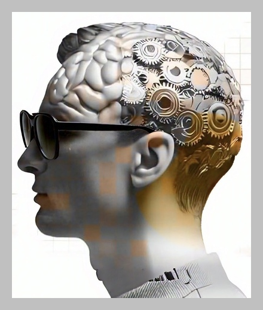

# Demystifying AI: Real-World Machine Learning for the Greater Good

  

## About Me:
I’m an avid programmer with a deep passion for harnessing technology to create meaningful impact. Driven by a desire to contribute to the greater good, I dedicate my time to exploring how artificial intelligence and machine learning can address real-world challenges. Whether it’s through coding, learning, or sharing knowledge, my goal is to inspire and empower others to leverage these powerful tools for the benefit of humanity. When time allows, I’m committed to building projects that make a positive difference, always keeping an eye on ethical considerations and the broader societal implications of technology.

## Mission: Bridging the Gap

Artificial Intelligence (AI) and Machine Learning (ML) are transforming our world, yet they often seem like enigmatic "black boxes." This project aims to **bridge the gap** between the complex algorithms and the tangible, real-world applications of this technology.

Our core mission is twofold:

1.  **Demystify AI/ML:** To make the concepts and capabilities of machine learning accessible and understandable to a wider audience – students, professionals, educators, and the genuinely curious.
2.  **Promote "ML for Good":** To specifically highlight and explore how AI/ML is being used (or could be used) to address pressing global challenges and contribute positively to society.

We believe that by showcasing concrete examples, we can foster a better understanding, encourage ethical development, and inspire more people to leverage these powerful tools for the greater good.

## Why Focus on Real-World Examples?

* **Tangibility:** Abstract algorithms become concrete when tied to a problem they solve (e.g., detecting diseases in medical images, predicting crop yields, optimizing disaster relief).
* **Inspiration:** Seeing practical applications can spark new ideas and encourage learners to pursue projects with positive impact.
* **Accessibility:** Real-world scenarios provide context that makes technical concepts easier to grasp, even for those without a deep mathematical background.
* **Informed Discussion:** Understanding how AI works in practice enables more nuanced conversations about its benefits, risks, and ethical implications.

## What You'll Find Here

This repository (or project/resource) serves as a curated collection of examples and explanations demonstrating AI/ML in action. Expect to find:

* **Case Studies:** Detailed breakdowns of specific projects or applications across various domains (Healthcare, Environment, Education, Accessibility, Social Justice, Finance, etc.).
* **Concept Explanations:** Simple, clear descriptions of the core ML concepts used in the featured examples (e.g., classification, regression, clustering, natural language processing, computer vision, time series analysis) linked directly to their application.
* **Focus on Impact:** Analysis of *how* the AI/ML solution contributes to solving the problem and its potential or measured impact.
* **Links to Resources:** Pointers to relevant datasets, research papers, articles, code repositories (where available and appropriate), allowing for deeper exploration.
* **(Optional) Code Snippets:** Illustrative code examples (e.g., in Python using common libraries like Scikit-learn, TensorFlow, PyTorch) to demonstrate key parts of the solution.

## Target Audience

This resource is for anyone interested in understanding the practical side of AI and ML, including:

* Students: Learning about AI/ML and looking for practical context.
* Developers & Engineers: Seeking inspiration or exploring new application domains.
* Educators: Searching for relatable examples to use in teaching.
* Non-Technical Professionals: Wanting to understand how AI might impact their field or society.
* Policy Makers & Ethicists: Needing concrete examples to inform discussions and decisions.
* Anyone Curious: Individuals simply wanting to peek behind the curtain of AI.

## Example Areas Explored (Illustrative)

*(This section would be populated with actual examples as the project grows)*

* **Healthcare:**
    * *Example:* AI for detecting diabetic retinopathy from eye scans.
    * *Concept:* Image Classification.
    * *Impact:* Early detection, improved accessibility in remote areas.
* **Environment:**
    * *Example:* Using satellite imagery and ML to track deforestation.
    * *Concept:* Computer Vision, Change Detection.
    * *Impact:* Monitoring environmental changes, informing conservation efforts.
* **Accessibility:**
    * *Example:* Real-time sign language translation using pose estimation.
    * *Concept:* Computer Vision, Sequence-to-Sequence models.
    * *Impact:* Improving communication for the deaf and hard of hearing.
* **Disaster Response:**
    * *Example:* Optimizing resource allocation using predictive modeling based on damage reports.
    * *Concept:* Regression, Optimization Algorithms.
    * *Impact:* Faster, more effective aid delivery.
* **Time Series Analysis / Financial Markets:**
    * *Example:* Analyzing sequential data like stock market OHLC (Open, High, Low, Close) data to identify patterns or forecast future values.
    * *Concept:* Time Series Forecasting, Regression, Pattern Recognition (e.g., using models like ARIMA, LSTMs).
    * *Impact:* Informing investment strategies, economic modeling, and risk assessment.

## Featured Technology: The Rust Programming Language

While much ML development happens in languages like Python, understanding other powerful tools can be beneficial. Rust is a modern systems programming language gaining traction for its unique combination of features.

**Core Focuses of Rust:**

* **Performance:** Aims to provide speed comparable to C and C++, compiling to efficient native code with minimal runtime overhead.
* **Memory Safety:** Guarantees memory safety (preventing null pointers, dangling pointers, buffer overflows) *at compile time* without needing a garbage collector, primarily through its ownership and borrowing system.
* **Concurrency:** Enables writing concurrent (multi-threaded) programs with confidence by preventing data races at compile time.

**Key Advantages of Rust:**

* **Safety without Sacrificing Speed:** Eliminates entire classes of common bugs related to memory management and concurrency, without the runtime performance cost typically associated with garbage-collected languages.
* **Fearless Concurrency:** The ownership and type system makes it significantly safer and easier to write correct multi-threaded code by catching potential data races during compilation.
* **High Performance:** Ideal for CPU-intensive tasks, systems programming, embedded devices, and situations where predictable performance is critical.
* **Excellent Tooling:** Comes with `Cargo`, an integrated package manager, build system, test runner, and documentation generator, providing a productive development experience out-of-the-box. Tools like `rustfmt` (auto-formatter) and `clippy` (linter) further enhance code quality.
* **Strong Type System & Modern Features:** Features like traits, generics, pattern matching, and expressive enums help in writing robust and maintainable code.
* **Interoperability:** Can interface effectively with C codebases (FFI), allowing gradual adoption or integration into existing systems.
* **Growing Ecosystem:** Has a vibrant community and a rapidly expanding collection of libraries (`crates`) available on `crates.io`.

**Relevance for AI/ML:** Although Python remains dominant for ML research and rapid prototyping, Rust's advantages make it suitable for:
    * Building high-performance ML infrastructure and tooling.
    * Developing computationally intensive algorithms or data processing pipelines (e.g., libraries like Polars leverage Rust).
    * Deploying ML models efficiently, especially in resource-constrained environments (like web assembly or embedded systems).
    * Writing safer and faster components that can be called from other languages (like Python).

## How to Use This Resource

1.  **Browse:** Explore the case studies based on application areas or ML concepts that interest you.
2.  **Learn:** Read the explanations to understand *how* ML is being applied.
3.  **Dive Deeper:** Follow the provided links for more in-depth information or technical details.
4.  **Contribute:** Share examples you know of or help improve existing ones!

##
